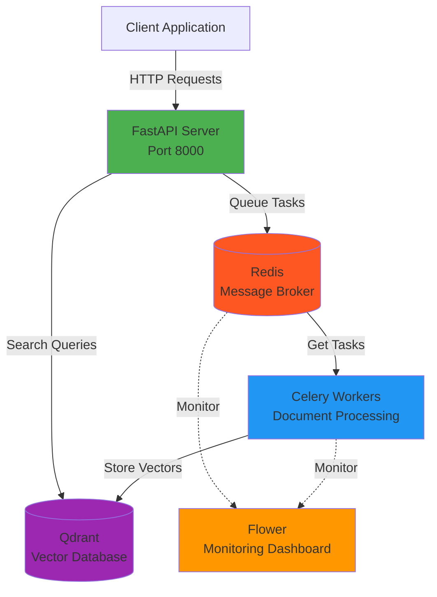
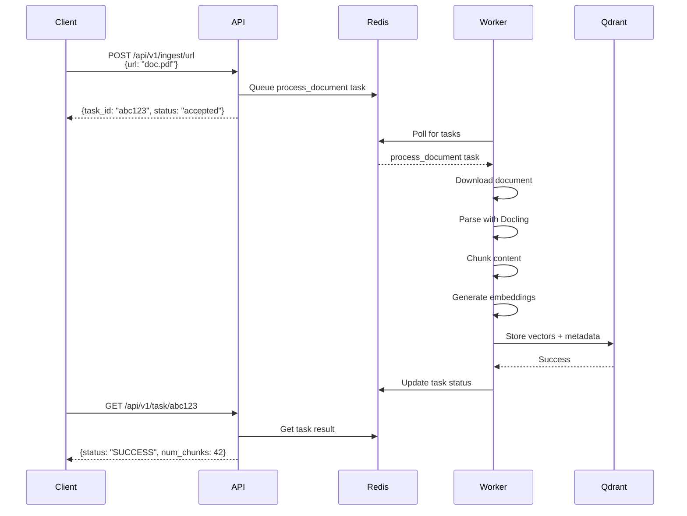
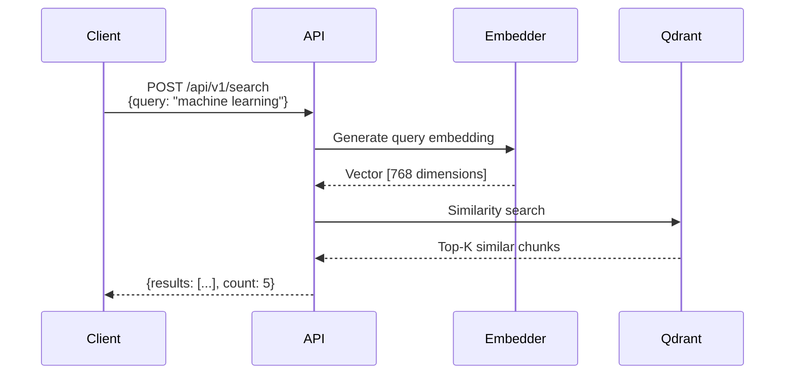

# QSearch - Document Processing & RAG API

A high-performance asynchronous FastAPI service for document processing and Retrieval-Augmented Generation (RAG). Built with modern Python technologies to handle document ingestion, semantic search, and vector storage at scale.

## Overview

QSearch provides a complete pipeline for document processing and retrieval:
- **Ingest** documents from URLs or file uploads
- **Process** documents asynchronously with Docling
- **Chunk** content intelligently for optimal retrieval
- **Embed** text using state-of-the-art models
- **Store** vectors in Qdrant for fast similarity search
- **Search** using semantic similarity with RAG capabilities

## Key Features

- **Asynchronous Processing**: Non-blocking document processing with Celery workers
- **Multiple Input Sources**: Support for URL-based and file upload ingestion
- **Intelligent Chunking**: Document-aware chunking via Docling integration
- **Vector Search**: Semantic similarity search powered by Qdrant
- **RESTful API**: Modern FastAPI interface with automatic OpenAPI documentation
- **Scalable Architecture**: Horizontally scalable with Redis message queue
- **Task Monitoring**: Real-time task status tracking and optional Flower dashboard
- **Production Ready**: Docker-based deployment with health checks and logging

## Architecture



## Technology Stack

| Component | Technology | Purpose |
|-----------|-----------|---------|
| **API Framework** | FastAPI | High-performance async web framework |
| **Task Queue** | Celery | Distributed asynchronous task processing |
| **Message Broker** | Redis | Task queue and result backend |
| **Vector Database** | Qdrant | Similarity search and vector storage |
| **Document Processing** | Docling | PDF parsing and intelligent chunking |
| **Embeddings** | sentence-transformers | Text-to-vector conversion |
| **Containerization** | Docker & Docker Compose | Service orchestration |

## How It Works

### Document Ingestion Flow



### Search Flow



## Quick Start

### Prerequisites

- Docker & Docker Compose (recommended)
- Python 3.10+ (for local development)
- 4GB+ RAM (Docling can be memory-intensive)

### Option 1: Docker Deployment (Recommended)

**Start all services with one command:**

```bash
# Clone repository
git clone https://github.com/turkersenturk/qsearch.git
cd qsearch

# Start entire stack (API + Worker + Redis + Qdrant)
docker-compose up -d

# View logs
docker-compose logs -f
```

**Services will be available at:**

| Service | URL | Description |
|---------|-----|-------------|
| API | http://localhost:8000 | Main REST API |
| API Docs | http://localhost:8000/docs | Interactive Swagger UI |
| Qdrant Dashboard | http://localhost:6333/dashboard | Vector database UI |
| Redis | localhost:6379 | Message broker (internal) |

**Optional: Start with monitoring:**

```bash
docker-compose --profile monitoring up -d
```

This adds Flower monitoring at http://localhost:5555

### Option 2: Local Development

For development without Docker:

```bash
# 1. Create and activate virtual environment
python -m venv venv
source venv/bin/activate  # Linux/Mac
# venv\Scripts\activate    # Windows

# 2. Install dependencies
pip install -r requirements.txt

# 3. Start Redis and Qdrant in Docker
docker-compose up -d redis qdrant

# 4. Configure environment
cp .env.example .env
# Edit .env if needed

# 5. Start API server (Terminal 1)
uvicorn app.main:app --reload --port 8000

# 6. Start Celery worker (Terminal 2)
celery -A app.worker.celery_app worker --loglevel=info --concurrency=2

# 7. (Optional) Start Flower monitoring (Terminal 3)
celery -A app.worker.celery_app flower
```

## API Reference

### 1. Ingest Document from URL

Upload a document from a web URL for processing.

**Request:**
```bash
curl -X POST "http://localhost:8000/api/v1/ingest/url" \
  -H "Content-Type: application/json" \
  -d '{
    "url": "https://example.com/document.pdf",
    "metadata": {
      "category": "research",
      "author": "John Doe"
    }
  }'
```

**Response:**
```json
{
  "task_id": "abc123-def456-789",
  "status": "accepted",
  "message": "Document ingestion started for URL: https://example.com/document.pdf"
}
```

### 2. Ingest Document from File

Upload a document file directly.

**Request:**
```bash
curl -X POST "http://localhost:8000/api/v1/ingest/file" \
  -F "file=@/path/to/document.pdf" \
  -F 'metadata={"category": "research", "author": "Jane Smith"}'
```

**Response:**
```json
{
  "task_id": "xyz789-uvw456-123",
  "status": "accepted",
  "message": "Document ingestion started for file: document.pdf"
}
```

### 3. Check Task Status

Monitor the progress of an ingestion task.

**Request:**
```bash
curl "http://localhost:8000/api/v1/task/abc123-def456-789"
```

**Response (Success):**
```json
{
  "task_id": "abc123-def456-789",
  "status": "SUCCESS",
  "message": "Task completed successfully",
  "result": {
    "status": "success",
    "num_chunks": 42,
    "source": "https://example.com/document.pdf",
    "embedding_dimension": 768
  }
}
```

**Response (Processing):**
```json
{
  "task_id": "abc123-def456-789",
  "status": "STARTED",
  "message": "Task is being processed"
}
```

**Response (Failed):**
```json
{
  "task_id": "abc123-def456-789",
  "status": "FAILURE",
  "message": "Task failed",
  "error": "Unable to download document from URL"
}
```

### 4. Search Documents

Perform semantic search across ingested documents.

**Request:**
```bash
curl -X POST "http://localhost:8000/api/v1/search" \
  -H "Content-Type: application/json" \
  -d '{
    "query": "machine learning algorithms",
    "limit": 5,
    "score_threshold": 0.7
  }'
```

**Response:**
```json
{
  "query": "machine learning algorithms",
  "count": 3,
  "results": [
    {
      "text": "Machine learning is a subset of artificial intelligence that focuses on developing algorithms...",
      "source": "https://example.com/ml-guide.pdf",
      "score": 0.89,
      "metadata": {
        "chunk_index": 5,
        "category": "research",
        "author": "John Doe"
      }
    },
    {
      "text": "Supervised learning algorithms learn from labeled training data...",
      "source": "https://example.com/ai-basics.pdf",
      "score": 0.82,
      "metadata": {
        "chunk_index": 12,
        "category": "tutorial"
      }
    }
  ]
}
```

**Query Parameters:**
- `query` (required): Search text
- `limit` (optional, default: 5): Maximum results to return (1-100)
- `score_threshold` (optional): Minimum similarity score (0.0-1.0)
- `filters` (optional): Additional metadata filters

### 5. Delete Document

Remove all chunks from a specific document.

**Request:**
```bash
curl -X DELETE "http://localhost:8000/api/v1/document?source=https://example.com/document.pdf"
```

**Response:**
```json
{
  "task_id": "del123-456-789",
  "status": "accepted",
  "message": "Document deletion started for: https://example.com/document.pdf"
}
```

### 6. Health Check

Check API service status.

**Request:**
```bash
curl "http://localhost:8000/health"
```

**Response:**
```json
{
  "status": "healthy",
  "service": "qsearch-api"
}
```

## Project Structure

```
qsearch/
├── app/
│   ├── __init__.py
│   ├── main.py                 # FastAPI application entry point
│   ├── worker.py               # Celery worker configuration
│   │
│   ├── api/                    # API endpoints
│   │   ├── __init__.py
│   │   ├── ingest.py          # Document ingestion endpoints
│   │   └── search.py          # Search endpoints
│   │
│   ├── core/                   # Core configuration
│   │   ├── __init__.py
│   │   └── config.py          # Environment settings & config
│   │
│   ├── services/               # Business logic
│   │   ├── __init__.py
│   │   ├── docling.py         # Document processing service
│   │   └── qdrant.py          # Vector database service
│   │
│   └── tasks/                  # Celery tasks
│       ├── __init__.py
│       └── process.py         # Background processing tasks
│
├── tests/                      # Test suite
│   ├── __init__.py
│   └── test_api.py
│
├── docker-compose.yml          # Service orchestration
├── Dockerfile                  # Container image definition
├── requirements.txt            # Python dependencies
├── .env.example               # Environment variables template
├── .gitignore
├── LICENSE
└── README.md                  # This file
```

## Configuration

Environment variables can be set in `.env` file or as system environment variables:

| Variable | Default | Description |
|----------|---------|-------------|
| `REDIS_URL` | `redis://localhost:6379/0` | Redis connection URL |
| `QDRANT_URL` | `http://localhost:6333` | Qdrant server URL |
| `QDRANT_COLLECTION_NAME` | `documents` | Qdrant collection name |
| `CELERY_BROKER_URL` | Same as REDIS_URL | Celery message broker |
| `CELERY_RESULT_BACKEND` | Same as REDIS_URL | Celery result backend |
| `ENVIRONMENT` | `development` | Environment (development/production) |
| `LOG_LEVEL` | `INFO` | Logging level |
| `API_HOST` | `0.0.0.0` | API server host |
| `API_PORT` | `8000` | API server port |
| `SHARED_TEMP_DIR` | `/tmp/qsearch` | Temporary file storage |

## Development

### Docker Commands

```bash
# View running services
docker-compose ps

# View logs
docker-compose logs -f           # All services
docker-compose logs -f api       # API only
docker-compose logs -f celery-worker  # Worker only

# Restart services
docker-compose restart api
docker-compose restart celery-worker

# Stop all services
docker-compose down

# Stop and remove volumes (data will be lost)
docker-compose down -v

# Rebuild images
docker-compose build
docker-compose build --no-cache  # Without cache

# Rebuild and start
docker-compose up -d --build

# Execute commands in containers
docker-compose exec api bash
docker-compose exec celery-worker bash

# View resource usage
docker stats
```

### Running Tests

```bash
# Run tests locally
pytest

# Run tests in Docker
docker-compose exec api pytest

# Run with coverage
pytest --cov=app --cov-report=html
```

### Code Quality

```bash
# Format code
black .

# Lint code
ruff check .

# Type checking
mypy app/
```

## Performance & Scaling

### Concurrency Settings

**Celery Worker Concurrency:**
- Default: 2 workers
- Memory-intensive (Docling processing)
- Adjust based on available RAM:
  - 4GB RAM: concurrency=1
  - 8GB RAM: concurrency=2
  - 16GB+ RAM: concurrency=4

```bash
# Adjust in docker-compose.yml
command: celery -A app.worker.celery_app worker --loglevel=info --concurrency=2
```

### Horizontal Scaling

**Scale workers:**
```bash
docker-compose up -d --scale celery-worker=3
```

**Load balancing:**
- Use nginx or traefik for API load balancing
- Redis handles worker distribution automatically

### Performance Tips

1. **Embedding Model**: Default is `all-MiniLM-L6-v2` (fast, 768-dim)
   - For better accuracy: `all-mpnet-base-v2` (slower, 768-dim)
   - For speed: `all-MiniLM-L12-v2` (384-dim)

2. **Qdrant Optimization**:
   - Use quantization for large collections
   - Enable disk storage for collections > 1M vectors

3. **Redis Persistence**:
   - Configured with AOF (Append-Only File)
   - Adjust `appendfsync` in redis.conf for performance

## Monitoring

### Flower Dashboard

Monitor Celery tasks in real-time:

```bash
# Start with monitoring
docker-compose --profile monitoring up -d

# Access dashboard
open http://localhost:5555
```

**Features:**
- Real-time task monitoring
- Worker status and statistics
- Task history and details
- Rate limiting and controls

### Logging

Structured logging with configurable levels:

```bash
# View API logs
docker-compose logs -f api

# View worker logs
docker-compose logs -f celery-worker

# Follow all logs
docker-compose logs -f
```

## Troubleshooting

### Common Issues

**1. Worker Out of Memory**
```bash
# Reduce concurrency
celery -A app.worker.celery_app worker --loglevel=info --concurrency=1
```

**2. Qdrant Connection Failed**
```bash
# Check Qdrant health
curl http://localhost:6333/health

# Restart Qdrant
docker-compose restart qdrant
```

**3. Redis Connection Issues**
```bash
# Test Redis connection
docker-compose exec redis redis-cli ping
# Expected: PONG

# View Redis logs
docker-compose logs redis
```

**4. Task Stuck in PENDING**
```bash
# Check worker status
celery -A app.worker.celery_app inspect active

# Restart worker
docker-compose restart celery-worker
```

### Debug Mode

Enable detailed logging:

```bash
# In .env file
LOG_LEVEL=DEBUG
ENVIRONMENT=development

# Restart services
docker-compose restart
```

## Production Deployment

### Security Checklist

- [ ] Configure CORS origins in [main.py](app/main.py)
- [ ] Set strong Redis password
- [ ] Enable Qdrant authentication
- [ ] Use HTTPS/TLS for API
- [ ] Implement rate limiting
- [ ] Set up monitoring and alerts
- [ ] Configure log aggregation
- [ ] Regular backups of Qdrant data

### Recommended Setup

```yaml
# Production docker-compose additions
api:
  deploy:
    replicas: 3
    resources:
      limits:
        cpus: '2'
        memory: 4G
      reservations:
        cpus: '1'
        memory: 2G
  restart: always

celery-worker:
  deploy:
    replicas: 2
    resources:
      limits:
        memory: 8G
  restart: always
```

## API Documentation

Interactive API documentation is automatically generated and available when the service is running:

- **Swagger UI**: http://localhost:8000/docs
- **ReDoc**: http://localhost:8000/redoc
- **OpenAPI JSON**: http://localhost:8000/openapi.json

## Contributing

Contributions are welcome! Please follow these guidelines:

1. Fork the repository
2. Create a feature branch (`git checkout -b feature/amazing-feature`)
3. Commit your changes (`git commit -m 'Add amazing feature'`)
4. Push to the branch (`git push origin feature/amazing-feature`)
5. Open a Pull Request

## License

This project is licensed under the GNU General Public License v3.0 - see the [LICENSE](LICENSE) file for details.

## Support

- **Issues**: https://github.com/turkersenturk/qsearch/issues
- **Discussions**: https://github.com/turkersenturk/qsearch/discussions

## Acknowledgments

- **FastAPI**: For the excellent async web framework
- **Celery**: For robust task queue implementation
- **Qdrant**: For powerful vector search capabilities
- **Docling**: For document processing and chunking
- **sentence-transformers**: For state-of-the-art embeddings
